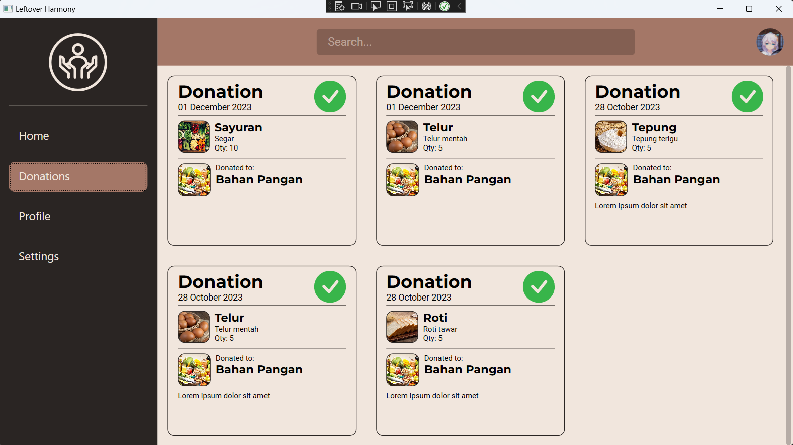
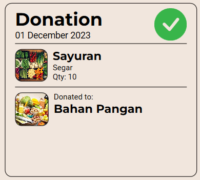

# Donation Window

Donations window is where us as a user, could see the past history of the donations that we gave to a certain request. 

    

As we could see from the picture above, the recent donation that the user did will all be shown specifically with some information given in a form of display card.

    

The card gives us specific information about the donation, such as the *date of the donation*, *object of the donation*, *donation quantity*, and *where the donation is given*