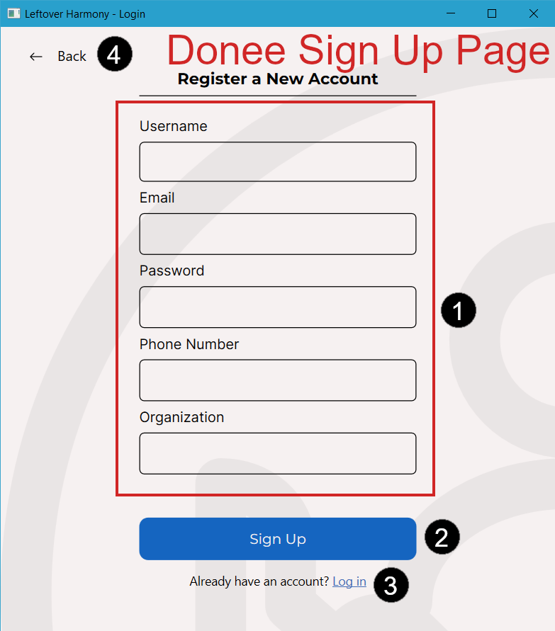

# Creating an account on Leftover Harmony

When opening the application you are prompted to log in to an account in the [Authentication Window](../windows/authentication_window.md). This requires the user to sign up if they haven't made an account previously.

## Signing up for a new account
Leftover Harmony has two account roles, Donor and Donee (see [Account](../account.md)) where the sign up process between them are slightly different.

### Sign up as a Donor

To sign up as a donor, you can follow these steps:
1. Click sign up button below the login button or number (4) in image above labeled [Login Page](../windows/authentication_window.md#login-page).
2. Click Donor button in the left side or number (1) in image above labeled [Role Selection Page](../windows/authentication_window.md#role-selection-page).
3. Fill up the details in the register form or number (1) in image above labeled [Donor Sign Up Page](../windows/authentication_window.md#sign-up-page).
4. Click Sign Up button or number (2) in image above labeled [Donor Sign Up Page](../windows/authentication_window.md#sign-up-page).
5. Sign Up completed and you should be navigated back to [Login Page](../windows/authentication_window.md#login-page).

### Sign up as a Donee

To sign up as a donor, you can follow these steps:
1. Click sign up button below the login button or number (4) in image above labeled [Login Page](../windows/authentication_window.md#login-page).
2. Click Donee button in the right side or number (2) in image above labeled [Role Selection Page](../windows/authentication_window.md#role-selection-page).
3. Fill up the details in the register form or number (1) in image above labeled [Donee Sign Up Page](../windows/authentication_window.md#sign-up-page).
4. Click Sign Up button or number (2) in image above labeled [Done Sign Up Page](../windows/authentication_window.md#sign-up-page).
5. Sign Up completed and you should be navigated back to [Login Page](../windows/authentication_window.md#login-page).