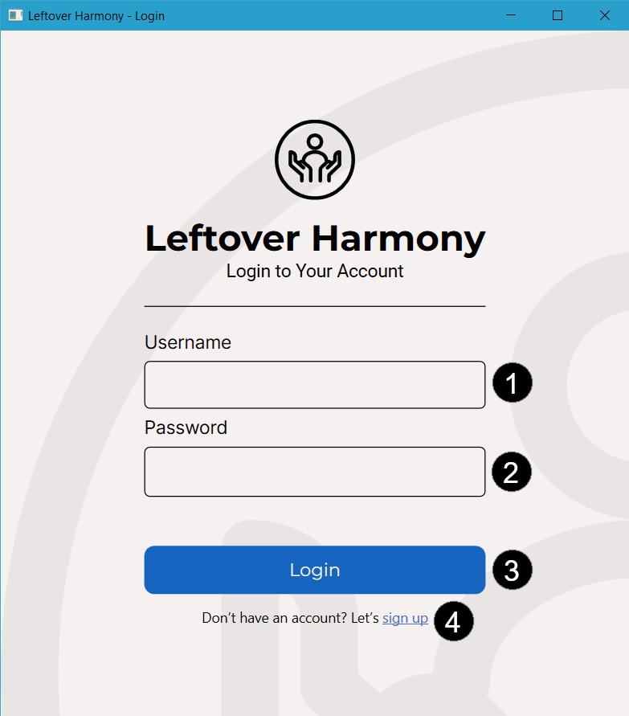
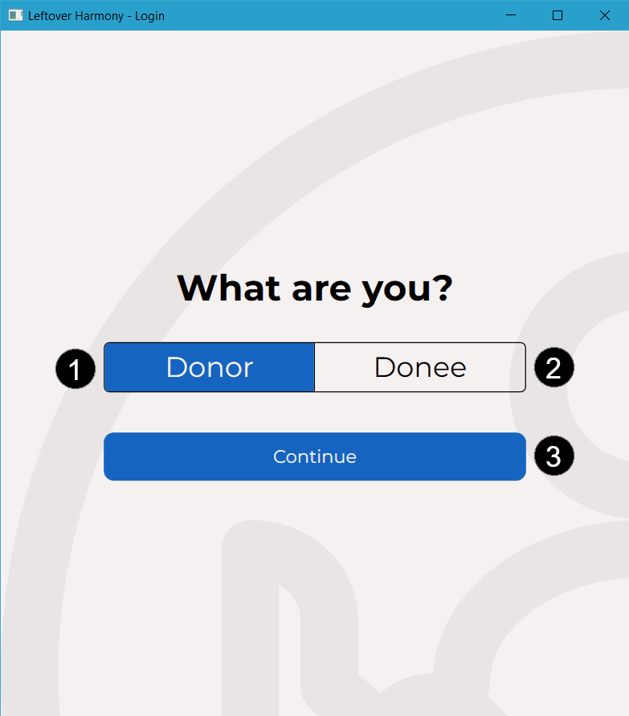
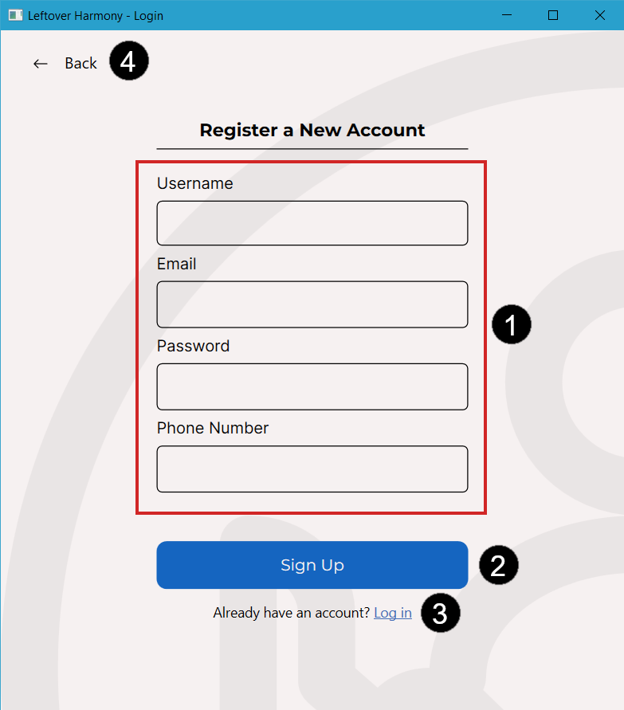
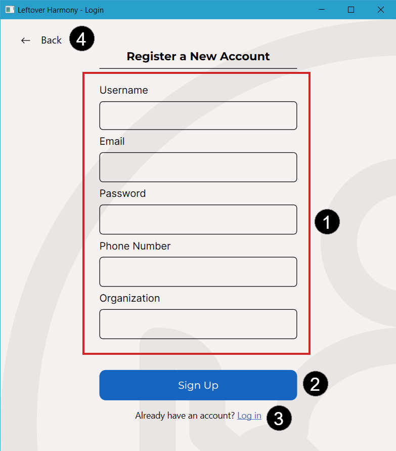

# Authentication Window

When you open Leftover Harmony, it immediately show the authentication window. Authentication window has 3 pages:
1. Login Page
2. Role Selection Page
3. Sign Up Page

## Login Page
Login page is the default page displayed whenever Authentication Window is opened.

You will see 4 main parts where all of them are useful for authentication method.
1. *Username Box:* A text box to input your username
2. *Password Box:* A text box to input your password
3. *Login Button:* A button to log in to your account
4. *Sign Up Link:* A button to switch to [Role Selection Page](#role-selection-page)

## Role Selection Page
Role Selection Page is a page for new users to select their account role before making an account (see [Account](../account.md)).

There are 3 main parts in this page:
1. *Donor Button:* A button to select your role as
2. *Donee Button:* A text box to input your password
3. *Continue Button:* A button to continue to [Sign Up Page](#sign-up-page). This button will not be visible until you select a role.

# Sign Up Page
Sign Up Page is a page for new users to make their new account after selecting their account role (see [Account](../account.md)).

Sign Up Page has two versions, Donor Sign Up Page (left) and Donee Sign Up Page (right). While different for each roles, it is mostly similar and consist of 4 main parts.
1. *Account Details:* A form for new user to put their account detail to be created.
2. *Sign Up Button:* Button to create the new account after providing their account details.
3. *Log In Link:* Link for existing users to go back to [Login Page](#login-page).
4. *Back Button:* Button to go back to [Role Selection page](#role-selection-page).
