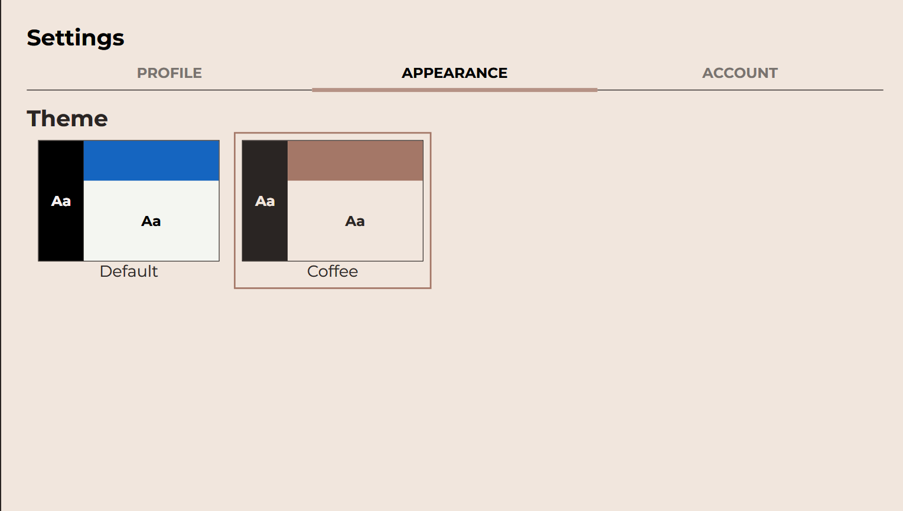
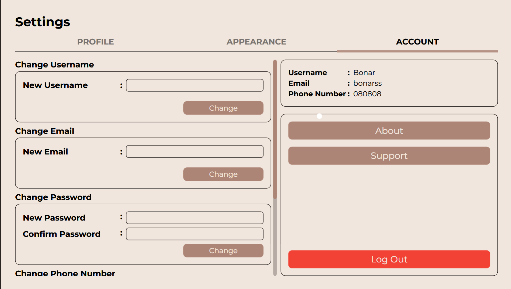

# Settings
Here ini settings page user are able to customize appearance, profile information, and account information. On the settings page, user will find 3 tabs, that is Profile tab, Appearance tab, and Account tab. 

## Profile tab
On the profile tab, user may customize their profile that will be shown to the other user. User may customize Display name, Bio, and profile picture in this tab. For the profile picture, only picture with .png extension that is allowed to use for the profile picture. Just simply click the profile page frame then choose your desired png picture.

## Appearance tab
On the appearance tab available 2 theme presets, this number might be increases in the incoming updates. User may choose 1 of the available theme preset to change the desired color theme. User just need to click the desired theme and the color theme of the application will be change immediately

## Account tab
The last tab, user are able to change their personal information about their account. Information can be changed independently, this mean user are able to change their information 1 by 1. In this tab, there are also available information about the application and support center.

    